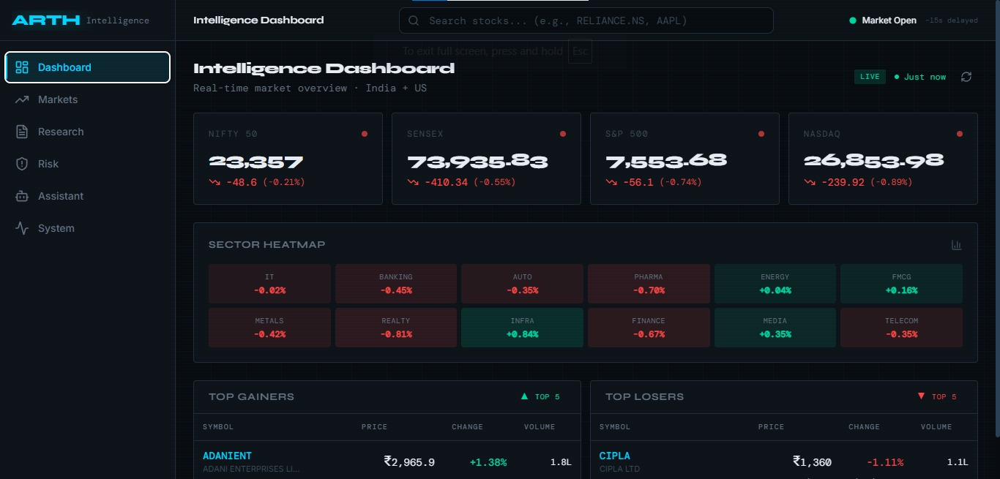
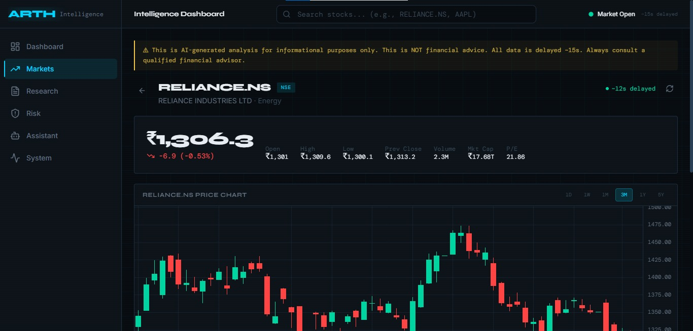
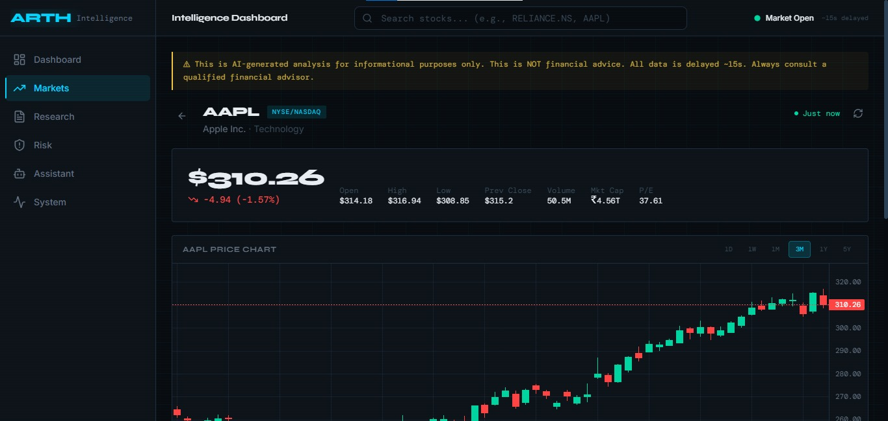
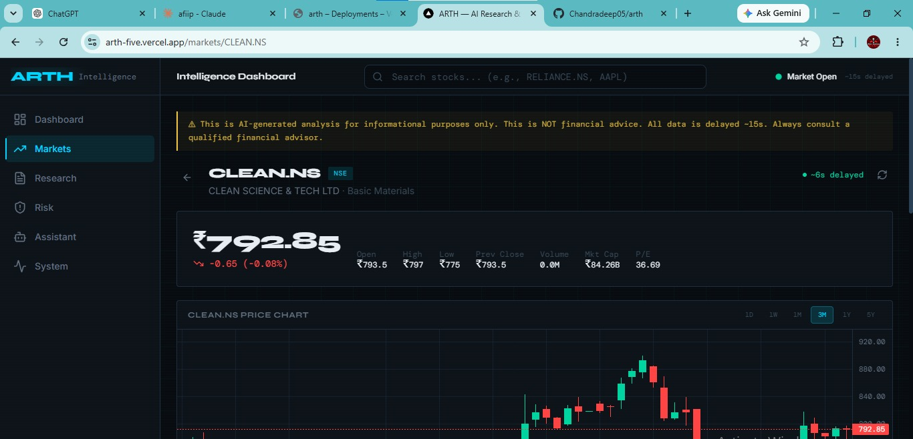
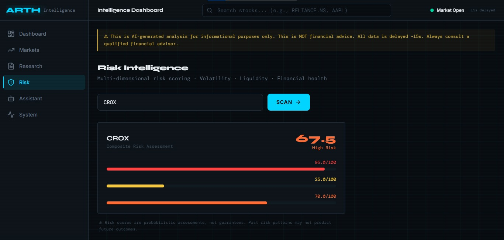
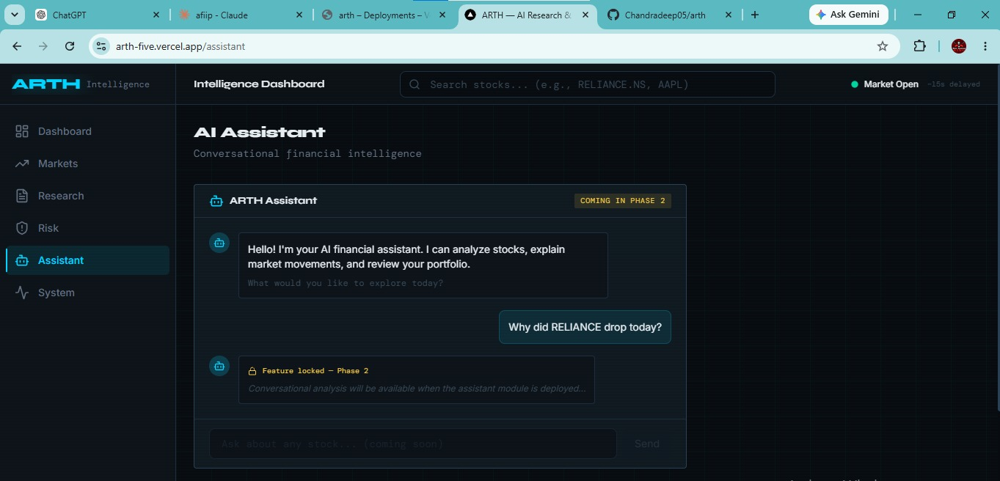

<p align="center">
  <h1 align="center">ARTH</h1>
  <p align="center"><strong>AI Research & Trading Hub</strong></p>
  <p align="center">
    Institutional-grade decision-support infrastructure combining real-time market intelligence,<br/>
    AI-generated research, probabilistic risk scoring, sentiment analysis, and live market data.
  </p>
</p>

<p align="center">
  
  
  
  
  
  
</p>

---

## What is ARTH?

**ARTH** is a full-stack financial intelligence platform designed to provide Bloomberg-terminal-level insights using open-source tools and free-tier APIs. It combines live market data from Yahoo Finance with AI-powered analysis from Groq's LLaMA 3.3 70B to deliver:

- **Live Market Dashboard** — Real-time indices (NIFTY 50, SENSEX, S&P 500, NASDAQ), sector heatmaps, top gainers/losers
- **Stock Deep-Dive** — Candlestick charts with volume, technical indicators (RSI, MACD, Bollinger Bands, VWAP), timeframe switching
- **AI Research Reports** — Institutional-grade company analysis with bull/bear thesis, streamed via SSE
- **Risk Scoring Engine** — Multi-dimensional risk assessment with sector-aware D/E normalization (volatility, liquidity, financial health)
- **Sentiment Analysis** — Market sentiment scoring with confidence calibration and methodology transparency
- **System Health Monitor** — Live backend health, data source status, LLM connectivity

> ⚠️ **Disclaimer**: ARTH provides AI-generated analysis for informational purposes only. This is **NOT financial advice**. All data is delayed ~15 seconds. Always consult a qualified financial advisor before making investment decisions.

---

## Interface Preview

### 🖥️ Live Market Dashboard


### 📈 Stock Deep-Dive (Markets Explorer)
| Indian Markets (`RELIANCE.NS`) | US Markets (`AAPL`) |
|---|---|
|  |  |

> ℹ️ **Vercel Dynamic Routing**: Dot-separated extensions (e.g. `.NS`) are fully routed correctly on Vercel deployment:
> 

### 🛡️ Risk Intelligence Engine


### 💬 AI Assistant (Coming in Phase 2)


---

## Architecture

```
┌─────────────────────────────────────────────────────────────────┐
│                     Next.js 16 Frontend                         │
│           (Vercel / Turbopack / localhost:3000)                  │
│                                                                 │
│  ┌──────────┐ ┌──────────┐ ┌──────────┐ ┌──────────┐          │
│  │Dashboard │ │ Markets  │ │ Research │ │  Risk    │          │
│  │ (Live)   │ │(Search+  │ │  (AI     │ │(Scoring) │          │
│  │          │ │ Charts)  │ │ Reports) │ │          │          │
│  └──────────┘ └──────────┘ └──────────┘ └──────────┘          │
└─────────────────────┬───────────────────────────────────────────┘
                      │ REST + SSE (Server-Sent Events)
┌─────────────────────▼───────────────────────────────────────────┐
│                     FastAPI Backend                              │
│            (Render Free Tier / localhost:8000)                    │
│                                                                 │
│  ┌─────────────────────────────────────────────────────────┐   │
│  │              Intelligence Engines                        │   │
│  │  ┌──────────┐ ┌──────────┐ ┌──────────┐ ┌──────────┐  │   │
│  │  │ Market   │ │ Research │ │Sentiment │ │  Risk    │  │   │
│  │  │ Engine   │ │ Engine   │ │ Engine   │ │ Engine   │  │   │
│  │  │          │ │(Groq LLM)│ │          │ │(Sector-  │  │   │
│  │  │          │ │          │ │          │ │  Aware)  │  │   │
│  │  └────┬─────┘ └────┬─────┘ └────┬─────┘ └────┬─────┘  │   │
│  └───────┼────────────┼────────────┼────────────┼──────────┘   │
│          │            │            │            │               │
│  ┌───────▼────────────▼────────────▼────────────▼──────────┐   │
│  │         Data Adapter Layer (Circuit Breaker + Retry)     │   │
│  │    Yahoo Finance │ Alpha Vantage (P2) │ NewsAPI (P2)     │   │
│  └──────────────────────────────────────────────────────────┘   │
└───────────────────┬──────────────┬──────────────────────────────┘
                    │              │
         ┌──────────▼──┐  ┌───────▼──────┐
         │ TimescaleDB  │  │    Redis     │
         │   (OHLCV)    │  │   (Cache)    │
         │  [Optional]  │  │  [Optional]  │
         └──────────────┘  └──────────────┘
```

### Key Design Decisions

| Decision | Rationale |
|---|---|
| **Yahoo Finance as sole data source** | Free, reliable, covers NSE/BSE/NYSE/NASDAQ. No API key needed. |
| **Groq LLM (LLaMA 3.3 70B)** | Free tier: 14,400 req/day. Sub-second inference. Ideal for research reports. |
| **Circuit breaker pattern** | Yahoo Finance has undocumented rate limits. Exponential backoff with 3 retries. |
| **Sector-aware D/E scoring** | Banks (D/E 7x normal) vs IT (D/E 0.1x normal) require different risk thresholds. |
| **SSE for research streaming** | Research reports generate in real-time. SSE streams tokens as they arrive. |
| **TimescaleDB/Redis optional** | Phase 1 works without them. App degrades gracefully — no caching, fresh data. |
| **Self-ping keepalive** | Background task pings `/health` every 4 min to prevent Render free-tier sleep. UptimeRobot as external backup. |

---

## Quick Start

### Prerequisites

- **Python 3.9+** (tested on 3.9.7)
- **Node.js 18+** (tested on 20.x)
- **Groq API key** — Free at [console.groq.com](https://console.groq.com)
- **Docker** (optional) — Only needed for TimescaleDB and Redis

### 1. Clone & Setup Backend

```bash
git clone https://github.com/YOUR_USERNAME/arth.git
cd arth/backend

# Create virtual environment
python -m venv .venv

# Activate (Windows)
.venv\Scripts\activate

# Activate (macOS/Linux)
source .venv/bin/activate

# Install dependencies
pip install -r requirements.txt

# Configure environment
cp ../.env.example .env
# Edit .env and add your GROQ_API_KEY
```

### 2. Setup Frontend

```bash
cd ../frontend
npm install
```

### 3. Start Services

```bash
# Terminal 1 — Backend (from /backend)
uvicorn app.main:app --reload --port 8000 --host 0.0.0.0

# Terminal 2 — Frontend (from /frontend)
npm run dev
```

### 4. Open

| Service | URL |
|---|---|
| **Dashboard** | [http://localhost:3000](http://localhost:3000) |
| **API Docs (Swagger)** | [http://localhost:8000/docs](http://localhost:8000/docs) |
| **Health Check** | [http://localhost:8000/health](http://localhost:8000/health) |

### 5. (Optional) Infrastructure

```bash
# Start TimescaleDB + Redis for caching
docker compose up -d
```

---

## API Reference

### Market Data

| Endpoint | Method | Description | Example |
|---|---|---|---|
| `/api/v1/market/quote/{symbol}` | GET | Live stock quote | `/api/v1/market/quote/RELIANCE.NS` |
| `/api/v1/market/ohlcv/{symbol}` | GET | Historical OHLCV bars | `/api/v1/market/ohlcv/TCS.NS?period=3mo` |
| `/api/v1/market/indices` | GET | Major market indices | Returns NIFTY 50, SENSEX, S&P 500, NASDAQ |
| `/api/v1/market/search?q={query}` | GET | Stock search | `/api/v1/market/search?q=reliance` |
| `/api/v1/market/company/{symbol}` | GET | Company fundamentals | `/api/v1/market/company/INFY.NS` |

### Intelligence Engines

| Endpoint | Method | Description | Example |
|---|---|---|---|
| `/api/v1/research/generate/{symbol}` | POST | AI research report (SSE stream) | `?stream=true&depth=detailed` |
| `/api/v1/sentiment/{symbol}` | GET | Sentiment analysis with confidence | Returns label, score, methodology |
| `/api/v1/risk/{symbol}` | GET | Multi-dimensional risk scoring | Returns composite score, sector-aware D/E |
| `/api/v1/indicators/{symbol}` | GET | Technical indicators | RSI, MACD, Bollinger Bands, VWAP |

### System

| Endpoint | Method | Description |
|---|---|---|
| `/api/v1/system/health` | GET | Full system health check |
| `/health` | GET | Simple liveness probe |

---

## Markets Supported

| Market | Exchange | Symbol Format | Example |
|---|---|---|---|
| 🇮🇳 India | NSE | `SYMBOL.NS` | `RELIANCE.NS`, `TCS.NS` |
| 🇮🇳 India | BSE | `SYMBOL.BO` | `RELIANCE.BO` |
| 🇺🇸 United States | NYSE/NASDAQ | `SYMBOL` | `AAPL`, `MSFT`, `GOOGL` |

### Pre-configured Watchlist

**Indian Stocks**: RELIANCE, TCS, HDFCBANK, INFY, ICICIBANK, SBIN, BAJFINANCE, WIPRO, ITC, KOTAKBANK, LT, HCLTECH, AXISBANK, SUNPHARMA, MARUTI, BHARTIARTL, TATASTEEL, NTPC, POWERGRID, ADANIENT, HINDALCO, DRREDDY, CIPLA, TECHM, ONGC, JSWSTEEL, DLF, ZEEL, BAJAJFINSV

**US Stocks**: AAPL, MSFT, GOOGL, AMZN, TSLA, NVDA, META, NFLX

---

## Tech Stack

### Backend
| Technology | Purpose |
|---|---|
| **FastAPI** | Async REST API framework |
| **Python 3.9+** | Runtime with asyncio |
| **yfinance** | Yahoo Finance data adapter |
| **Groq SDK** | LLM inference (LLaMA 3.3 70B) |
| **NumPy** | Technical indicator calculations |
| **Pydantic v2** | Request/response validation |
| **SQLAlchemy** | ORM (TimescaleDB, optional) |
| **structlog** | Structured JSON logging |
| **aioredis** | Async Redis client (optional) |

### Frontend
| Technology | Purpose |
|---|---|
| **Next.js 16** | React framework with Turbopack |
| **TypeScript** | Type-safe frontend |
| **Tailwind CSS v4** | Utility-first styling |
| **Framer Motion** | Animations and transitions |
| **Recharts** | Data visualization |
| **Lightweight Charts** | Candlestick/OHLCV charts |
| **Lucide React** | Icon library |

### Infrastructure
| Technology | Purpose |
|---|---|
| **TimescaleDB** | Time-series PostgreSQL (optional) |
| **Redis** | TTL-based cache (optional) |
| **Docker Compose** | Local infrastructure |
| **Render** | Backend deployment (free tier + keepalive) |
| **Vercel** | Frontend deployment |

---

## Project Structure

```
arth/
├── backend/
│   ├── app/
│   │   ├── api/v1/              # REST endpoints
│   │   │   ├── market.py        # Quotes, OHLCV, indices, search
│   │   │   ├── research.py      # AI research report generation
│   │   │   ├── risk.py          # Risk scoring
│   │   │   ├── sentiment.py     # Sentiment analysis
│   │   │   ├── indicators.py    # Technical indicators
│   │   │   └── system.py        # Health checks
│   │   ├── core/
│   │   │   ├── exceptions.py    # Custom exception hierarchy
│   │   │   └── logging.py       # Structured logging setup
│   │   ├── data/adapters/
│   │   │   ├── base.py          # Circuit breaker base adapter
│   │   │   └── yahoo.py         # Yahoo Finance adapter
│   │   ├── engines/
│   │   │   ├── market/          # Market data processing
│   │   │   ├── research/        # LLM research generation
│   │   │   │   ├── engine.py    # Research orchestrator
│   │   │   │   └── prompts.py   # LLM prompt templates
│   │   │   ├── risk/
│   │   │   │   └── engine.py    # Sector-aware risk scoring
│   │   │   └── sentiment/
│   │   │       └── engine.py    # Sentiment with confidence
│   │   ├── llm/
│   │   │   ├── base.py          # LLM client interface
│   │   │   ├── groq_client.py   # Groq API client
│   │   │   └── ollama_client.py # Ollama local fallback
│   │   ├── config.py            # Pydantic settings
│   │   ├── dependencies.py      # DI container
│   │   └── main.py              # FastAPI app factory
│   ├── requirements.txt
│   └── .env                     # Local config (gitignored)
│
├── frontend/
│   ├── src/
│   │   ├── app/
│   │   │   ├── page.tsx         # Dashboard (live indices, heatmap)
│   │   │   ├── markets/
│   │   │   │   ├── page.tsx     # Stock search & quick access
│   │   │   │   └── [symbol]/
│   │   │   │       └── page.tsx # Stock detail (chart, indicators)
│   │   │   ├── research/        # AI Research Lab
│   │   │   ├── risk/            # Risk Scoring
│   │   │   ├── assistant/       # Phase 2 placeholder
│   │   │   ├── system/          # System health monitor
│   │   │   ├── layout.tsx       # Root layout
│   │   │   └── globals.css      # Design system
│   │   ├── components/
│   │   │   ├── layout/          # Sidebar, Header, StatusBar
│   │   │   ├── stock/           # Charts, Indicators, Research
│   │   │   └── shared/          # Disclaimer, Loading, Error
│   │   ├── lib/
│   │   │   ├── api.ts           # Typed HTTP client
│   │   │   └── constants.ts     # Configuration constants
│   │   └── types/               # TypeScript interfaces
│   ├── next.config.ts           # API proxy rewrites
│   └── package.json
│
├── .env.example                 # Environment template
├── docker-compose.yml           # TimescaleDB + Redis
├── render.yaml                  # Render deployment config
└── README.md
```

---

## Deployment

### Backend → Render (Free Tier)

1. Push code to GitHub
2. Go to [render.com](https://render.com) → **New** → **Web Service**
3. Connect your GitHub repo (`Chandradeep05/arth`)
4. Set **Root Directory** to `backend`
5. Set **Build Command** to `pip install -r requirements.txt`
6. Set **Start Command** to `uvicorn app.main:app --host 0.0.0.0 --port $PORT`
7. Add environment variables:
   ```
   GROQ_API_KEY=your_key_here
   APP_ENV=production
   DEBUG=false
   ALLOWED_ORIGINS=https://your-frontend.vercel.app
   ```
8. Deploy! Render auto-sets `RENDER_EXTERNAL_URL` (used by self-ping keepalive)

> **Anti-Sleep Setup**: The backend has a built-in self-ping that hits `/health` every 4 minutes.
> For extra reliability, add an [UptimeRobot](https://uptimerobot.com) monitor:
> - **Monitor Type**: HTTP(s)
> - **URL**: `https://your-render-url.onrender.com/health`
> - **Interval**: 5 minutes

### Frontend → Vercel

1. Import your GitHub repo in Vercel
2. Set root directory to `frontend`
3. Add environment variable:
   ```
   NEXT_PUBLIC_API_URL=https://your-backend.onrender.com
   ```
4. Vercel auto-detects Next.js

### Environment Variables Reference

| Variable | Required | Default | Description |
|---|---|---|---|
| `GROQ_API_KEY` | ✅ Yes | — | Groq API key for AI research |
| `APP_ENV` | No | `development` | `development` / `production` |
| `DEBUG` | No | `true` | Enable debug logging |
| `ALLOWED_ORIGINS` | No | `http://localhost:3000` | CORS allowed origins |
| `DATABASE_URL` | No | SQLite fallback | PostgreSQL connection string |
| `REDIS_URL` | No | In-memory fallback | Redis connection string |
| `RENDER_EXTERNAL_URL` | Auto | — | Set automatically by Render. Used by self-ping keepalive. |

---

## Notable Engineering Decisions

### Python Closure Bug Fix
Found and fixed a classic Python closure-in-a-loop bug in the Yahoo Finance adapter where `lambda: ticker.info` captured the loop variable by reference instead of by value. Fixed with `lambda t=ticker: t.info` across all 5 adapter methods. This was the root cause of incorrect market index values.

### Sector-Aware D/E Normalization
yfinance returns `debtToEquity` as a percentage (e.g., `36.65` = 0.3665x ratio). The naive `if de > 5` heuristic misfired on banks (HDFCBANK D/E ~7x is normal) and utilities (POWERGRID D/E ~1.5x is expected). Replaced with a sector-aware threshold map:

| Sector | Low D/E | Moderate | High | Very High |
|---|---|---|---|---|
| Banks/NBFCs | <5x | 5-10x | 10-15x | >15x |
| Financial Services | <4x | 4-8x | 8-12x | >12x |
| Utilities | <2x | 2-4x | 4-6x | >6x |
| Energy | <1x | 1-2.5x | 2.5-4x | >4x |
| Tech/FMCG/Pharma | <0.5x | 0.5-1.5x | 1.5-3x | >3x |

### Sentiment Confidence Calibration
At confidence below 50%, strong labels ("Bullish"/"Bearish") are suppressed to avoid misleading signals. Only genuinely high-confidence signals produce strong labels. The methodology is always disclosed in the response.

---

## Development Roadmap

| Phase | Status | Timeline | Key Features |
|---|---|---|---|
| **Phase 1** | ✅ Complete | 3-4 weeks | Live dashboard, stock search, OHLCV charts, technical indicators, AI research, risk scoring, sentiment |
| **Phase 2** | 🔜 Planned | 4-6 weeks | RAG research, FinBERT sentiment, anomaly detection, AI assistant, backtesting v1 |
| **Phase 3** | 📋 Planned | 6-8 weeks | Macroeconomic intelligence, FII/DII tracking, prediction models, knowledge graph |
| **Phase 4** | 📋 Planned | Open-ended | Portfolio optimization, strategy simulator, multi-market, mobile parity |

---

## Contributing

Contributions are welcome! Please read the guidelines below before submitting.

1. **Fork** the repository
2. Create a **feature branch** (`git checkout -b feature/amazing-feature`)
3. **Commit** your changes (`git commit -m 'feat: add amazing feature'`)
4. **Push** to the branch (`git push origin feature/amazing-feature`)
5. Open a **Pull Request**

### Commit Convention
We follow [Conventional Commits](https://www.conventionalcommits.org/):
- `feat:` — New features
- `fix:` — Bug fixes
- `docs:` — Documentation changes
- `refactor:` — Code refactoring
- `test:` — Adding tests
- `chore:` — Maintenance tasks

---

## License

This project is licensed under the MIT License — see the [LICENSE](LICENSE) file for details.

---

## Acknowledgments

- **Yahoo Finance** via [yfinance](https://github.com/ranaroussi/yfinance) — Market data
- **Groq** — Ultra-fast LLM inference
- **Meta AI** — LLaMA 3.3 70B model
- **Render** — Backend hosting (free tier)
- **UptimeRobot** — Keepalive monitoring

---

<p align="center">
  <strong>Built with ☕ and obsessive attention to data accuracy</strong><br/>
  <sub>ARTH — Because financial intelligence should be accessible to everyone</sub>
</p>
